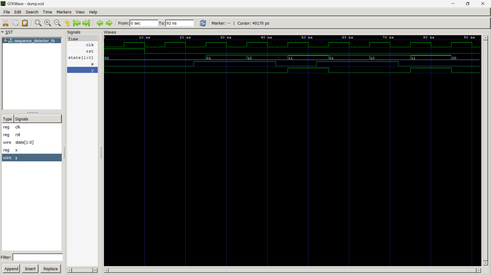

# Sequence Detector - 110

## Description
This project implements a Moore Finite State Machine (FSM) in Verilog to detect the binary sequence **110**.

## Features
- Moore FSM
- Verilog HDL implementation
- Testbench included
- Simulated using Icarus Verilog
- Waveform verified using GTKWave

## State Diagram
See `fsm_diagram.md`.

## Simulation
The waveform confirms that the output `y` becomes HIGH whenever the sequence **110** is detected.

## Files
- `sequence_detector.v` - Verilog design
- `sequence_detector_tb.v` - Testbench
- `fsm_diagram.md` - FSM state diagram

## Simulation Waveform

